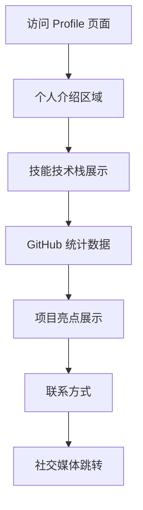

# GitHub Profile 页面美化改进方案

## 1. 产品概述

本方案旨在将当前简单的 GitHub Profile 页面升级为一个专业、美观、信息丰富的个人展示页面。通过添加多样化的可视化元素、个人介绍、技能展示等模块，打造一个能够充分展现个人技术能力和项目经验的专业形象页面。

## 2. 核心功能

### 2.1 功能模块

我们的 GitHub Profile 改进方案包含以下主要模块：

1. **个人介绍区域**：欢迎语、个人简介、当前状态
2. **技能技术栈**：编程语言、框架、工具展示
3. **统计数据展示**：GitHub 活动统计、代码贡献可视化
4. **项目亮点**：精选项目展示、成就徽章
5. **联系方式**：社交媒体链接、联系信息
6. **个性化元素**：动态效果、主题适配、互动元素

### 2.2 页面详情

| 模块名称 | 组件名称 | 功能描述 |
|---------|---------|----------|
| 个人介绍区域 | 欢迎横幅 | 动态打字效果的欢迎语，个人头像，当前工作状态 |
| 个人介绍区域 | 个人简介 | 简洁的自我介绍，技术兴趣方向，职业目标 |
| 技能展示 | 技术栈图标 | 使用图标展示掌握的编程语言和技术框架 |
| 技能展示 | 技能进度条 | 可视化展示各项技能的熟练程度 |
| 统计展示 | GitHub 统计卡片 | 显示 commits、stars、forks 等数据 |
| 统计展示 | 语言使用统计 | 最常用编程语言的分布图表 |
| 统计展示 | 贡献图动画 | 现有的蛇形动画贡献图 |
| 项目亮点 | 精选项目卡片 | 展示重要项目的预览和链接 |
| 项目亮点 | 成就徽章 | 显示获得的认证、奖项等成就 |
| 联系方式 | 社交媒体图标 | 链接到各个社交平台和联系方式 |
| 个性化元素 | 主题切换 | 支持亮色/暗色主题适配 |
| 个性化元素 | 动态效果 | 添加适度的动画和交互效果 |

## 3. 核心流程

用户访问 GitHub Profile 页面的浏览流程：

1. **首次进入** → 看到欢迎横幅和个人介绍
2. **向下浏览** → 查看技能技术栈展示
3. **继续浏览** → 查看 GitHub 统计数据和贡献图
4. **深入了解** → 浏览精选项目和成就展示
5. **联系互动** → 通过社交媒体链接进行联系

## 4. 用户界面设计

### 4.1 设计风格

- **主色调**：深蓝色 (#0366d6) 和 GitHub 绿色 (#28a745)
- **辅助色**：灰色系 (#586069, #f6f8fa) 用于背景和文字
- **按钮样式**：圆角矩形，渐变效果，悬停动画
- **字体**：主标题使用 'Segoe UI'，代码字体使用 'Fira Code'
- **布局风格**：卡片式设计，响应式布局，居中对齐
- **图标风格**：使用 Font Awesome 和 Simple Icons，统一的圆角风格

### 4.2 页面设计概览

| 模块名称 | 组件名称 | UI 元素 |
|---------|---------|--------|
| 个人介绍区域 | 欢迎横幅 | 渐变背景，居中布局，动态打字效果，圆形头像 |
| 技能展示 | 技术栈图标 | 网格布局，彩色图标，悬停放大效果 |
| 统计展示 | 统计卡片 | 卡片阴影，圆角边框，数据动画效果 |
| 项目展示 | 项目卡片 | 缩略图预览，标签分类，链接按钮 |
| 联系方式 | 社交图标 | 圆形图标，悬停变色，统一间距 |

### 4.3 响应式设计

- **桌面优先**：主要针对桌面浏览器优化
- **移动适配**：在移动设备上自动调整布局和字体大小
- **触摸优化**：增大点击区域，