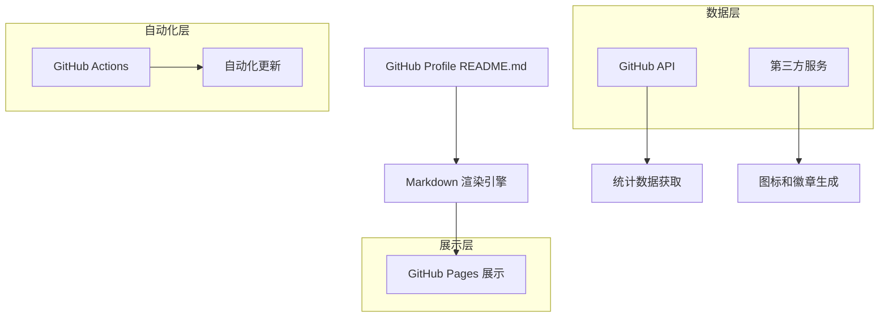

# GitHub Profile 页面美化技术架构文档

## 1. 架构设计



## 2. 技术描述

* **前端展示**：Markdown + HTML + CSS (内联样式)

* **数据源**：GitHub API + 第三方统计服务

* **自动化**：GitHub Actions 工作流

* **图标服务**：Simple Icons, Shields.io, Font Awesome

* **统计服务**：GitHub Readme Stats, GitHub Profile Trophy

## 3. 实现方案

### 3.1 核心技术栈

| 技术组件                | 用途      | 服务提供商                          |
| ------------------- | ------- | ------------------------------ |
| Markdown            | 页面结构和内容 | GitHub 原生支持                    |
| HTML                | 复杂布局和样式 | 内联 HTML 标签                     |
| CSS                 | 样式美化    | 内联样式                           |
| GitHub API          | 用户数据获取  | GitHub 官方                      |
| Shields.io          | 徽章生成    | shields.io                     |
| Simple Icons        | 技术图标    | simpleicons.org                |
| GitHub Readme Stats | 统计图表    | github-readme-stats.vercel.app |
| GitHub Actions      | 自动化更新   | GitHub 官方                      |

### 3.2 数据获取方式

**静态数据**：

* 个人信息、技能列表、项目介绍等通过 Markdown 直接编写

* 社交媒体链接、联系方式等手动维护

**动态数据**：

* GitHub 统计数据通过 GitHub Readme Stats API 获取

* 贡献图动画通过 GitHub Actions 定期生成

* 编程语言统计通过 GitHub API 实时获取

### 3.3 自动化更新机制

```yaml
# .github/workflows/update-readme.yml
name: Update README
on:
  schedule:
    - cron: '0 0 * * *'  # 每日更新
  workflow_dispatch:
  push:
    branches: [ main ]

jobs:
  update:
    runs-on: ubuntu-latest
    steps:
      - uses: actions/checkout@v3
      - name: Update README
        run: |
          # 更新动态内容的脚本
```

## 4. 实现细节

### 4.1 个人介绍区域实现

```markdown
<!-- 动态打字效果 -->
<h1 align="center">
  
</h1>

<!-- 个人头像和简介 -->
<div align="center">
  
  <h3>🚀 Passionate Developer | 💡 Problem Solver | 🌱 Lifelong Learner</h3>
</div>
```

### 4.2 技能展示实现

```markdown
## 🛠️ 技术栈

<div align="center">
  
### 编程语言


### 前端技术


### 后端技术


### 数据库


### 工具平台


</div>
```

### 4.3 统计数据展示

```markdown
## 📊 GitHub 统计

<div align="center">
  


</div>

<!-- 贡献图 -->
<div align="center">
  
</div>

<!-- GitHub Trophy -->
<div align="center">
  
</div>
```

### 4.4 项目展示实现

```markdown
## 🚀 精选项目

<div align="center">

[](https://github.com/Jarvis636431/project1)
[](https://github.com/Jarvis636431/project2)

</div>
```

### 4.5 联系方式实现

```markdown
## 📫 联系我

<div align="center">
  
[](mailto:your.email@example.com)
[](https://linkedin.com/in/yourprofile)
[](https://twitter.com/yourhandle)
[](https://yourblog.com)

</div>
```

## 5. 性能优化

### 5.1 图片优化

* 使用 CDN 加速图片加载

* 合理控制图片尺寸和数量

* 使用 SVG 格式的图标和徽章

### 5.2 缓存策略

* GitHub Readme Stats 自带缓存机制

* 静态资源使用长期缓存

* 动态内容设置合理的更新频率

### 5.3 加载优化

* 减少外部服务依赖

* 使用懒加载技术

* 优化 Markdown 结构和嵌套层级

